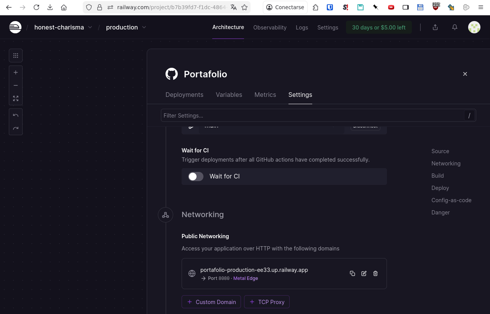
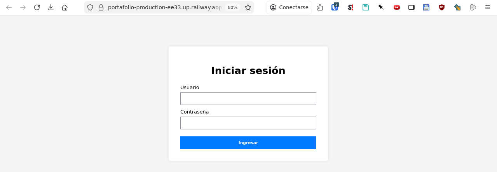

# Portafolio técnico de Pablo Varas

Este repositorio reúne proyectos desarrollados durante el módulo, junto con enlaces a una demo publicada en la nube y al código fuente. Su objetivo es servir como carta de presentación técnica y concentrar en un solo lugar el sistema desarrollado.

---

## 1. Sobre mí

Soy estudiante del área de desarrollo de software, con especial interés en:

- Aplicaciones web con **Java y Spring Boot**.
- Desarrollo de APIs REST y consumo de servicios.
- Buenas prácticas de desarrollo: control de versiones con Git, documentación y pruebas básicas.

Este portafolio se irá ampliando a medida que incorpore nuevos proyectos y evidencia de aprendizaje.

---

## 2. Estructura del repositorio

La estructura principal de este repositorio es:

- `m6_sistema_capacitaciones/`  
  Proyecto completo del **Sistema de Capacitaciones** (Spring Boot + Thymeleaf).

- `capturas/`  
  Carpeta con capturas de pantalla utilizadas como evidencia del hosting y de la demo en producción.

- `README.md`  
  Este documento de presentación general del portafolio.

En el futuro se podrán agregar nuevas carpetas con más proyectos o ejercicios relevantes.

---

## 3. Proyecto destacado: Sistema de Capacitaciones

Proyecto desarrollado con **Spring Boot 3**, **Spring Data JPA**, **Thymeleaf** y base de datos H2/MariaDB para gestionar cursos de capacitación, empleados, instructores e inscripciones.

### 3.1 Funcionalidades principales

- Gestión de cursos (crear, editar, listar, eliminar).
- Gestión de empleados e instructores.
- Inscripción de empleados en cursos disponibles.
- Módulo web con vistas Thymeleaf.
- Control de acceso por roles (ADMIN y EMPLEADO).

### 3.2 Código fuente

El código fuente completo del proyecto se encuentra en:

- **Código fuente (GitHub):**  
  https://github.com/pabvarass/Portafolio/tree/main/m6_sistema_capacitaciones

Dentro de esa carpeta se incluye:

- Código fuente organizado en capas (`controller`, `service`, `repository`, `model`, `api`, `config`…).
- Archivo `pom.xml` con las dependencias del proyecto.
- `src/main/resources/application.properties` con la configuración de la aplicación.
- Carpeta `capturas/` con evidencias del funcionamiento.
- Un `README.md` específico del proyecto con instrucciones de uso local.

---

## 4. Demo en la nube (servicio cloud)

De acuerdo a las instrucciones de la actividad, el proyecto se publica en un servicio de hosting gratuito en la nube.

- **Servicio cloud utilizado:** Railway  
- **Demo en producción (Railway):**  
  https://portafolio-production-ee33.up.railway.app

Desde esa URL se puede acceder a la aplicación web del Sistema de Capacitaciones desplegada en la nube.

---

## 5. Evidencias visuales de hosting y demo en producción

A continuación se presentan capturas de pantalla como respaldo del hosting seleccionado y del funcionamiento de la demo en producción.

### 5.1 Servicio desplegado en Railway

Captura del servicio configurado y en ejecución en Railway:



### 5.2 Pantalla de inicio de sesión en producción

Captura del formulario de inicio de sesión del Sistema de Capacitaciones en el entorno de producción (Railway):



---

## 6. Video de presentación técnica

Como parte del portafolio se incorporará un video técnico (3–5 minutos) donde se explica el Sistema de Capacitaciones, su arquitectura y las tecnologías utilizadas.

El video mostrará:

- Presentación breve.
- Recorrido por la aplicación (demo local y/o en Railway).
- Explicación de las tecnologías y decisiones de diseño.
- Comentarios sobre dificultades y aprendizajes.

**Enlace:** se agregará aquí el vínculo cuando el video esté publicado en YouTube.

---

## 7. Cómo clonar este repositorio

Para clonar el portafolio en tu equipo:

```bash
git clone https://github.com/pabvarass/Portafolio.git
cd Portafolio
